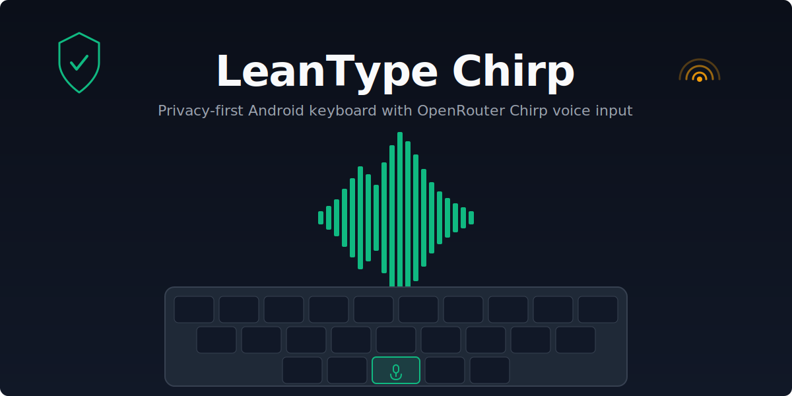

# LeanType Chirp

<p align="center">
  
</p>

<p align="center">
  <a href="https://github.com/AutomatorAlex/leantype-chirp/releases/latest"></a>
  <a href="https://github.com/AutomatorAlex/leantype-chirp/releases/latest"></a>
</p>

<p align="center">
<sup><b>GitHub Releases</b> — download the APK directly.<br/>
<b>Obtainium</b> — add <code>https://github.com/AutomatorAlex/leantype-chirp</code> as an app source.</sup>
</p>

<p align="center">
<sup>Install via <b>GitHub Releases</b> (download APK directly) or <b>Obtainium</b> — add<br/><code>https://github.com/AutomatorAlex/leantype-chirp</code> as an app source.</sup>
</p>

**LeanType Chirp** is a fork of [LeanType](https://github.com/LeanBitLab/HeliboardL), which is a fork of [HeliBoard](https://github.com/Helium314/HeliBoard), [OpenBoard](https://github.com/openboard-team/openboard), and the AOSP LatinIME keyboard.

This fork adds optional **OpenRouter Chirp speech-to-text** directly to the LeanType microphone key:

- tap mic once to start recording
- tap mic again to stop and transcribe
- transcription inserts into the current text field
- no auxiliary IME
- no keyboard switching
- no background listening

Audio is sent to OpenRouter **only when you explicitly tap the mic key** and stop recording. The core keyboard remains local/private unless you opt into network-backed AI features.

## Lineage

```text
LeanType Chirp → LeanType → HeliBoard → OpenBoard → AOSP LatinIME
```

## Features

- Direct OpenRouter Chirp STT via the built-in mic key
- OpenRouter model selection, defaulting to `google/chirp-3`
- Credential-protected OpenRouter API key storage
- Existing LeanType AI features: Gemini, Groq, OpenAI-compatible proofread/translation
- Existing HeliBoard/OpenBoard features: custom layouts, themes, clipboard, multilingual typing, glide typing, emoji, one-handed/split/floating keyboard modes

## Setup: Chirp Voice Input

1. Install the **Standard** build.
2. Open **LeanType Chirp Settings → AI Integration**.
3. Enable **OpenRouter Chirp voice input**.
4. Enter your [OpenRouter API key](https://openrouter.ai/settings/keys).
5. Leave model as `google/chirp-3` or enter another OpenRouter STT model.
6. Open any normal text field.
7. Tap the mic key once to record.
8. Tap the mic key again to stop, transcribe, and insert text.

See [CHIRP_VOICE.md](CHIRP_VOICE.md) for detailed voice setup and privacy notes.

## Privacy

LeanType Chirp does not add telemetry or background collection.

Network use is user-triggered:

- **Chirp STT:** audio is recorded locally, encoded as WAV/base64, then sent to OpenRouter’s audio transcription endpoint only after you stop recording.
- **AI proofreading/translation:** selected text is sent only when you press the relevant AI action.

API keys are stored in Android credential-protected app storage. Review [SECURITY.md](SECURITY.md) for details.

## Build

Requirements:

- Android SDK 35+
- JDK 17
- Gradle wrapper from this repo

Debug build:

```bash
./gradlew :app:assembleStandardDebug
```

APK output:

```text
app/build/outputs/apk/standard/debug/
```

Release build:

```bash
./gradlew :app:assembleStandardRelease
```

## Contributing

See [CONTRIBUTING.md](CONTRIBUTING.md).

Chirp-specific bugs and improvements belong in this fork. Core keyboard, layout, or dictionary issues may belong upstream in LeanType or HeliBoard.

## Security

Do not report vulnerabilities in public issues. See [SECURITY.md](SECURITY.md).

## License

LeanType Chirp modifications are licensed under GPL-3.0, matching LeanType/HeliBoard/OpenBoard lineage.

See [LICENSE](LICENSE).

## Credits

- [LeanType](https://github.com/LeanBitLab/HeliboardL) by LeanBitLab
- [HeliBoard](https://github.com/Helium314/HeliBoard) by Helium314 and contributors
- [OpenBoard](https://github.com/openboard-team/openboard)
- AOSP LatinIME keyboard
- OpenRouter for model routing and the Chirp STT endpoint
